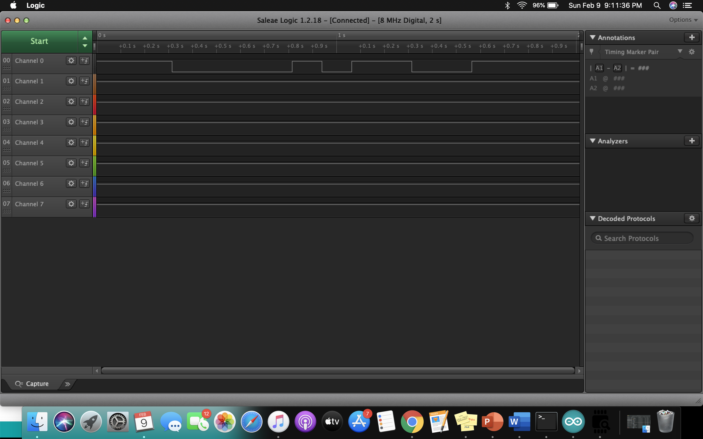
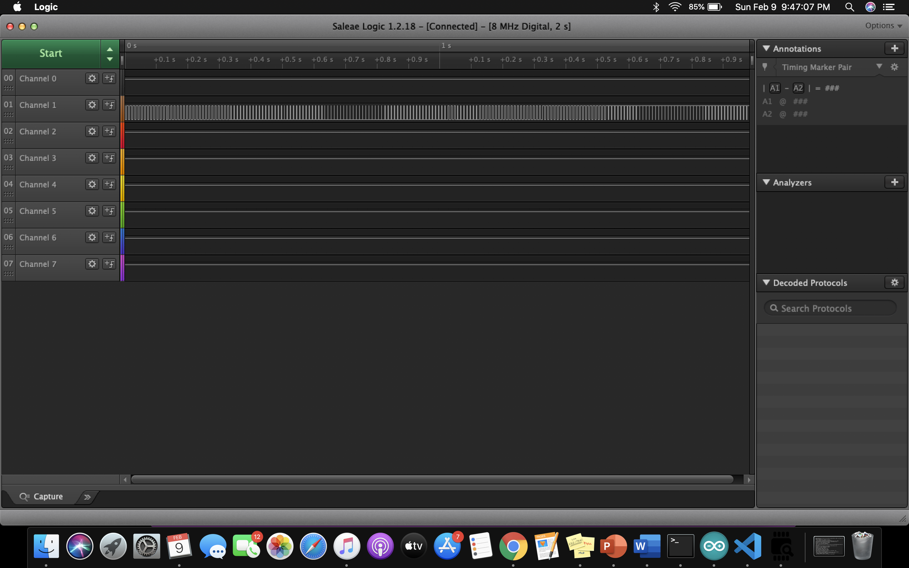
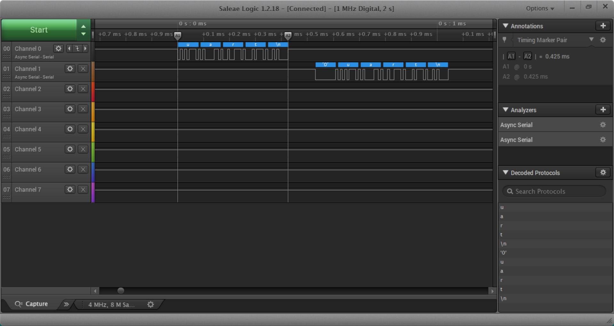
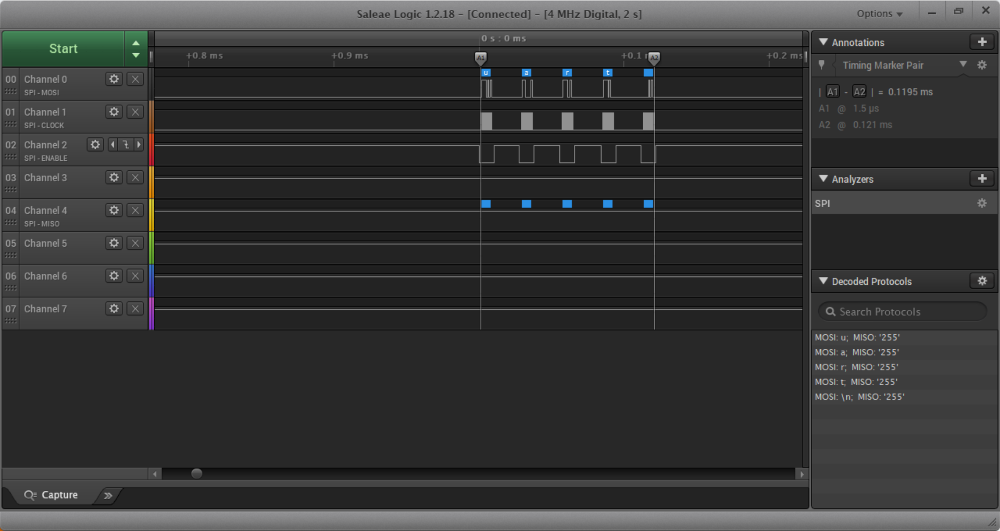

Name: Noah Zamarripa   

EID: naz296

Team Number: Team F11

## Questions

1. Why does your program need a setup and a loop?

    Both of these are needed because both have special purposes. The setup initializes global variables and essentially "sets up" the program. These variables can later be used by anything in the loop. These variables should not be in the loop because they would get called and reset multiple times. The loop on the other hand constantly repeats code that does whatever the programs wants it too.

2. What is the downside to putting all your code in a loop?

    If you put all the code inside the loop, variables will constantly be reset, ruining the program. Also, it will limit the program's ability to do more complex code because no methods can be made in a loop.

3. Why does your code need to be compiled?

    It needs this to do this in order to convert the C language to machine language that the computer can understand.

4. When lowering the frequency in procedure A, step 4, what is going wrong? Brainstorm some solutions. Dimmers exist in the real world. What is their solution?

    When the frequency is lowered, the LED starts flickering out and it becomes harder to tell if it's actually dimming. Some solutions to this are to keep the frequency at a constant 100, or something high like that. A dimmer switch can also be used to keep the LED from flickering out.

5. Why do you need to connect the logic analyzer ground to the ESP32 ground?

    You need to do this in order to create a closed circuit which means the logic analyzer can actually work. 

6. What is the difference between synchronous and asynchronous communication?

    Synchronous communication requires the sender and receiver of a message to first synchronize clocks while asynchronous communication does not require a clock in total. Furthermore, synchronous is faster than asynchronous when it comes to communication.

7. Profile of UART: Sent X bytes in Y time 

    Sent 4 bytes in 0.425 ms

8. Profile of SPI: Sent X bytes in Y time

    Sent 4 bytes in 0.1195 ms

9. Why is SPI so much faster than UART?

    SPI is faster than UART because SPI is synchronous and UART is asynchronous. Synchronous communication is faster than asynchronous because synchronous sends large frames of many bytes of data at a time while asynchronous communication sends one byte/character at a time. 

10. list one pro and one con of UART

    Pro: does not require clock 
    Con: slower than SPI

11. list one pro and one con of SPI

    Pro: very little overhead
    Con: Uses more wires than UART

12. list one pro and one con of I2C

    Pro: only requires a 2-wire bus
    Con: hardware of complexity increases as the number of master/slave devices increase

13. Why does I2C need external resistors to work?

    These resistors--called pull-up resisters--creates a default state for the input/output pins. 

## Screenshots

Procedure A, step 1:

Procedure A, step 4:

Procedure B, UART:

Procedure B, SPI:

